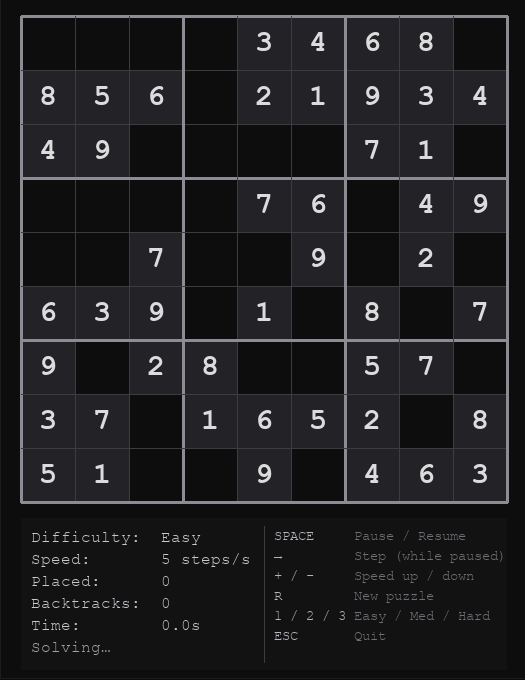

# Sudoku Solver

Animated backtracking Sudoku solver built with Python and Pygame. Puzzles are dynamically
generated at four difficulty levels and solved step-by-step — watch cells light up as digits
are placed, flash orange on backtrack, and a live stats overlay tracks progress.


---

## Demo


---

## How it works

A valid Sudoku puzzle is generated fresh each run using a two-phase algorithm:

1. **Fill** — a complete, valid 9×9 solution is built by placing shuffled digits with
   backtracking. The shuffle step ensures every run produces a different grid.
2. **Dig** — cells are removed one at a time in random order. After each removal,
   a uniqueness check (limited backtracking that exits after finding a second solution)
   verifies the puzzle still has exactly one answer. A cell is kept if removing it would
   break uniqueness. Difficulty controls the target clue count: Easy (~47), Medium (~40),
   Hard (~31).

The solver is a Python **generator function** — it yields one `SolverStep` after every
cell placement or backtrack. The Pygame game loop calls `next()` on the generator each
frame, pulling steps at a rate controlled by the speed setting. This keeps the animation
loop fully responsive without threads.

Cells glow **blue** when a digit is placed, flash **orange** when the solver backtracks,
and remain a neutral highlight once settled.

---

## Prerequisites

- Python 3.12+
- [`uv`](https://docs.astral.sh/uv/) (install once via PowerShell):
  ```powershell
  powershell -c "irm https://astral.sh/uv/install.ps1 | iex"
  ```

---

## Setup

```bash
git clone https://github.com/GrahlmanMatthew/Sudoku-Solver.git
cd Sudoku-Solver
uv sync
```

---

## Usage

```bash
python -m sudoku_solver
python -m sudoku_solver --difficulty hard
```

### Controls

| Key | Action |
|-----|--------|
| `SPACE` | Pause / Resume |
| `→` (RIGHT) | Advance one step (while paused) |
| `+` or `=` | Increase animation speed |
| `-` | Decrease animation speed |
| `R` | New puzzle at current difficulty |
| `1` | Switch to Easy |
| `2` | Switch to Medium |
| `3` | Switch to Hard |
| `ESC` | Quit |

---

## Configuration

| Environment variable | Default | Description |
|----------------------|---------|-------------|
| `DEBUG` | unset | Set to any value to enable debug logging |

---

## Running the tests

```bash
uv run pytest -v
uv run pytest --cov=sudoku_solver --cov-report=term-missing -v
```
